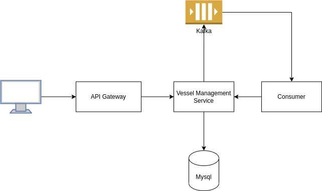
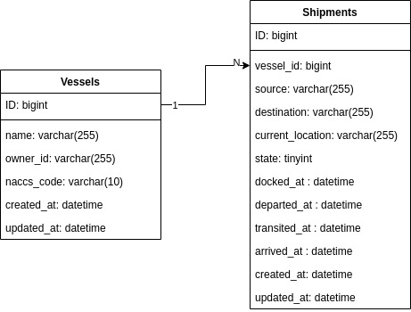

# vessel-management

## Summary
Vessel Management service is a service to serve information about vessel related stuffs

## Architecture Diagram


## Database Diagram


## Usage
Business logic for Vessels

## Installation

### Prerequisites
- Go 1.19
- Docker
- Docker Compose

### Setup

1. Clone this repository

```sh
git clone git@github.com:joshiaj7/vessel-management.git
```

2. Copy env variable

```sh
cp env.sample .env 
```

3. Build dependencies

- Set `GOPRIVATE`

```sh
export GOPRIVATE=github.com/joshiaj7/vessel-management/*
```

- Golang dependecy

```sh
go mod tidy
go mod vendor
```

- Unlisted Go Dependencies
    - [gomock](https://github.com/golang/mock)

- Service dependencies

```sh
docker-compose up --build
```

4. Check everything is OK

```sh
make test
make check
```

## Run the service
You can run it using docker-compose

```sh
docker-compose up --build
```
