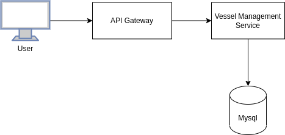
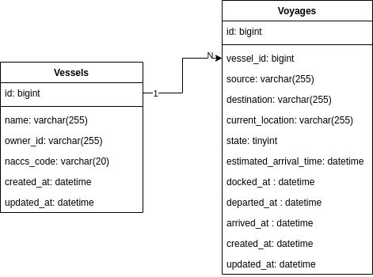

# vessel-management

## Summary
Vessel Management service is a service to serve information about vessel related stuffs

## Architecture Diagram


## Database Diagram


## Usage
Business logic for Vessels

## API Documentation
Below is a list of stable APIs

| No | Method | Endpoint         | Description           | Parameters                                                   |
|----|--------|------------------|-----------------------|--------------------------------------------------------------|
| 1  | POST   | /v1/vessels      | Create new vessel     | name (string), owner_id (int), naccs_code (string)           |
| 2  | GET    | /v1/vessels      | Get a list of vessels | name (string), owner_id (int), offset (int), limit (int)     |
| 3  | GET    | /v1/vessels/{id} | Get a single vessel   | id (int)                                                     |
| 4  | PUT    | /v1/vessels/{id} | Update a vessel       | id (int), name (string), owner_id (int), naccs_code (string) |

Voyage APIs is still in progress ;)

## Installation

### Prerequisites
- Go 1.19
- Docker
- Docker Compose

### Setup

1. Clone this repository

```sh
git clone git@github.com:joshiaj7/vessel-management.git
```

2. Copy env variable

```sh
cp env.sample .env 
```

3. Build dependencies

- Golang dependecy

```sh
go mod tidy
go mod vendor
```

- Unlisted Go Dependencies
    - [gomock](https://github.com/golang/mock)

- Service dependencies

```sh
docker-compose up --build
```

4. Check everything is OK

```sh
make test
```

## Run the service
You can run it using docker-compose

```sh
docker-compose up
```

Migrating database
You can use helper.sh to help migrating DB

```sh
source helper.sh
migrate-up
```

Try make a request using your favourite method (Postman, curl, etc.)
